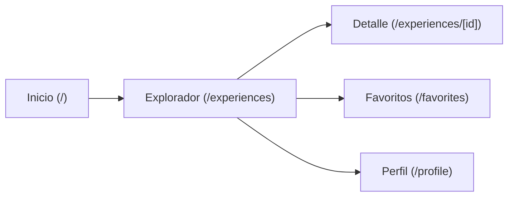
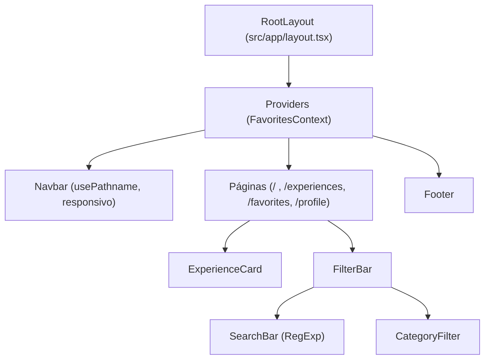

# Wonderlust Explorer (`ferminjmoreno-nextjs-wonderlust-explorer`)

Proyecto desarrollado en el marco del programa de **AI Engineering** de **4Geeks Academy**.

Aplicación web desarrollada con **Next.js (App Router)**, **TypeScript** y **Tailwind CSS v4** (sin ESLint), bajo la dirección de diseño oficial **Dribbble Travel Cards**.

---

## 🚀 Inicio Rápido

Para arrancar el servidor de desarrollo local:

```bash
npm run dev
```

Abre [http://localhost:3000](http://localhost:3000) en tu navegador para ver la aplicación.

---

## 🗺️ Arquitectura de Navegación y Rutas Implementadas

La plataforma cuenta con 5 rutas funcionales totalmente integradas:

1. **Página Principal — Home (`/`):**
   - Hero Section con titular inspirador, métricas globales y botón CTA principal que navega a `/experiences`.
   - Accesos directos a las 5 categorías y muestra destacada de experiencias con calificación perfecta (5.0★).
2. **Explorador de Experiencias (`/experiences`):**
   - Cuadrícula responsive exhibiendo las **100 tarjetas de experiencia**.
   - Barra de búsqueda reactiva por título mediante expresiones regulares case-insensitive (`RegExp`), selector por categorías con conteo dinámico, filtro de destino y selector de ordenación.
   - Estado amigable *"No se encontraron resultados"* con botón de restablecimiento rápido.
3. **Página de Detalle Dinámica (`/experiences/[id]`):**
   - Lectura dinámica del parámetro `id` desde la URL (1 al 100).
   - Título dinámico del documento actualizado vía `useEffect`.
   - Fotografía panorámica, botón interactivo de favoritos, itinerario, inclusiones y simulador de reserva con cálculo de precio por viajero.
4. **Colección de Favoritos (`/favorites`):**
   - Muestra exclusivamente las experiencias marcadas como favoritas.
   - Sincronización continua en `localStorage` y estado vacío reactivo.
5. **Perfil de Usuario (`/profile`):**
   - Perfil de viajero simulado (Fermín Moreno, miembro VIP Explorer).
   - Contador en tiempo real de favoritos guardados y estadísticas del viajero.

---

## 📊 Diagrama de Flujo de Navegación



---

## 🏛️ Diagrama de Arquitectura de Componentes y Estado



---

## 🛠️ Tecnologías y Estructura

- **Framework:** Next.js 16.3.6 (App Router)
- **Lenguaje:** TypeScript 5
- **Estilos:** Tailwind CSS v4 (Mobile-First y completamente responsivo)
- **Estado Global:** `FavoritesContext` con sincronización y persistencia en `localStorage`
- **Custom Hook:** `useFilters` para encapsular la lógica de filtrado y query params
- **Dataset:** 100 experiencias curadas en [`src/data/experience.ts`](src/data/experience.ts) (Adventure, Culture, Food, Wellness, Nature)

---

## 🎨 Referencia de Diseño Oficial

El diseño de interfaz de usuario de **Wonderlust Explorer** está inspirado oficialmente en el concepto visual de **Dribbble Travel Cards**:

* **Fuente / URL:** [https://dribbble.com/tags/travel-experience](https://dribbble.com/tags/travel-experience)
* **Captura del Diseño de Referencia:**


#### Especificaciones Visuales del Diseño Seleccionado:
1. **Contenedor y Elevación:**
   - Tarjetas con esquinas amplias y suaves (`rounded-3xl`).
   - Microinteracción de elevación al pasar el cursor: `transition-all duration-300 hover:-translate-y-1.5 hover:shadow-xl`.
2. **Fotografía y Badges Flotantes:**
   - Imagen principal inmersiva en formato 4:3 con efecto zoom sutil (`group-hover:scale-105`).
   - Insignia de categoría con efecto de cristal translúcido (*glassmorphism*): `backdrop-blur-md text-xs font-semibold px-3 py-1 rounded-full`.
3. **Jerarquía Tipográfica y Metadatos:**
   - Destino visible con pin geográfico y contraste suave.
   - Puntuación con estrella dorada destacada (`★ 4.9`).
   - Título en negrita de alto impacto con limitación de líneas (`line-clamp-1`).
   - Botón interactivo de favoritos con animación de corazón (toggle reactivo).
   - Precio por persona en bloque destacado con acento esmeralda.

---

## 📚 Documentación y Recursos

- [Repositorio en GitHub (4Geeks Academy)](https://github.com/4GeeksAcademy/ferminjmoreno-nextjs-wonderlust-explorer)
- [Documentación oficial de Next.js](https://nextjs.org/docs)
